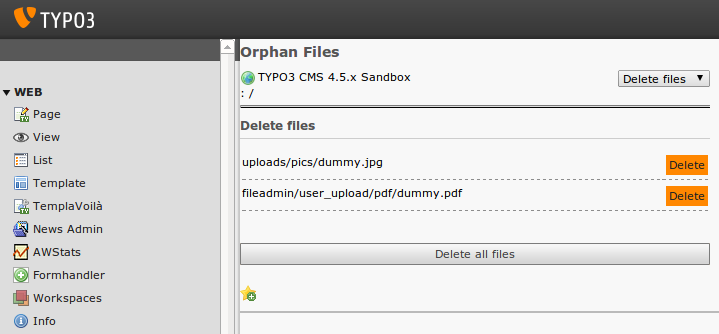

Screenshots
^^^^^^^^^^^

- In the above screenshot the tool did found two files which are
  supposed to be orphaned (one of them a PDF in fileadmin, the other one
  is an image which was uploaded in an image field, both are not used
  anymore)

- The editor may delete the files individually or all at once
